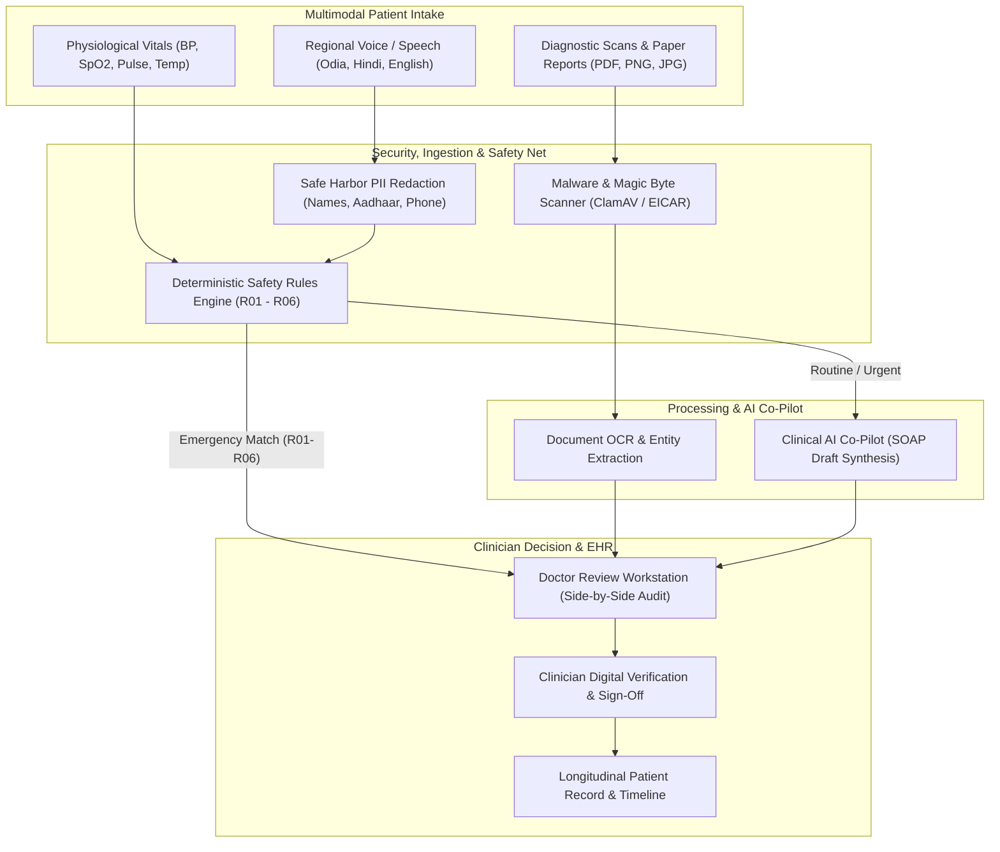

# CLINOVA AI — Comprehensive System Overview & Architectural Guide

**Project Name:** CLINOVA AI  
**Document Classification:** Executive Summary & Architectural Overview  
**Version:** 1.0.0 (Enterprise Edition)  
**Target Audience:** Clinicians, Engineers, Healthcare Administrators, and Stakeholders  

---

## 1. Executive Summary

**CLINOVA AI** is an enterprise-grade clinical decision support and Electronic Health Record (EHR) platform engineered to bridge the gap between rural primary health posts (Primary Health Centers / PHCs with intermittent or absent connectivity) and large tertiary district hospitals.

Its core operating philosophy is strict and uncompromising:  
**Artificial intelligence organizes, extracts, translates, and drafts — but qualified human medical professionals always retain exclusive diagnostic and clinical authority.**

---

## 2. Core Problem & Clinical Purpose

In rural and high-volume clinical settings, doctors and nurses face severe systemic challenges:
1. **Administrative Overload:** Up to 50% of clinician time is consumed by manual paperwork, transcribing handwriting, and re-entering patient vitals.
2. **Language Barriers:** Patients in rural health posts frequently speak regional languages or local dialects (e.g., Odia, Hindi) while central district specialists communicate in clinical English.
3. **Paper Records & Fragmentation:** Patients carry loose, crumpled paper laboratory sheets and prescriptions that are easily lost or corrupted.
4. **Intermittent Connectivity:** Rural health posts frequently lose internet connectivity, halting electronic entry in traditional cloud-only EHRs.
5. **Emergency Triage Delays:** Critical, life-threatening symptoms (such as acute myocardial infarction or pediatric distress) can be delayed in high-volume queues.

**CLINOVA AI addresses these challenges directly through an offline-capable, multimodal, and deterministic clinical co-pilot.**

---

## 3. High-Level System Architecture

---

## 4. User Roles & Permission Boundaries

CLINOVA AI enforces granular **Role-Based Access Control (RBAC)** across four clinical personas:

| Role | Operational Scope | Real-World Context |
| :--- | :--- | :--- |
| **Patient** | Read-only access to their personal medical records, active encounters, test results, and self-reported intake histories. | An individual reviewing their diagnostic history or submitting intake symptoms prior to arrival. |
| **Nurse / Triage Officer** | Conducts fast intake triage, enters vital signs, uploads diagnostic paper reports, and flags emergent cases for immediate referral. | A healthcare worker staffing the intake desk of a rural health sub-center. |
| **Doctor / Specialist** | Full clinical review desk: evaluates original scans alongside OCR-extracted values, edits AI SOAP drafts, assigns acuity, and signs consultations. | An emergency medical officer or district hospital specialist. |
| **Administrator** | Multi-facility tenant management, staff account provisioning, Prometheus telemetry oversight, and compliance retention sweeps. | Hospital Chief Information Officer (CIO) or regulatory compliance officer. |

---

## 5. The End-to-End Patient Journey

### Step 1: Multimodal Intake (`/intake`)
When a patient presents at a clinic or district facility:
- **Demographics & Identifiers:** Name, date of birth, gender, phone number, blood group, and emergency contacts are entered. Collision-safe Medical Record Numbers (`CLN-YYYY-XXXXXXXX`) are automatically generated.
- **Informed Consent:** Explicit clinical consent is verified and stored.
- **Multilingual Voice or Text:** The patient or nurse speaks in English, Hindi, or Odia. The built-in speech service normalizes spoken symptoms into clinical English while immutably preserving the original untranslated transcript.
- **Vitals Capture:** Blood pressure, pulse, SpO2, respiratory rate, and temperature are recorded with validation thresholds.
- **Diagnostic Scans:** Mobile photos or PDF uploads of blood work, discharge summaries, or radiology reports are captured.

### Step 2: Antivirus & Magic Byte Verification
Before any uploaded document enters the system:
1. **Magic Header Inspection:** Binary file signatures are verified to block disguised executables (PE, ELF, Java binaries, or executable scripts).
2. **Malware Defense:** Files are scanned via ClamAV / EICAR antivirus signatures. Infected files are isolated into an encrypted quarantine vault.
3. **Integrity Checksums:** Clean files receive a cryptographic SHA-256 fingerprint and are placed into partitioned storage (`storage_data/documents/facilities/...`).
4. **OCR & Entity Extraction:** The Optical Character Recognition engine extracts structured clinical fields (e.g., Hemoglobin, WBC count, Platelets) along with confidence scores.

### Step 3: PII Anonymization (Safe Harbor Redaction)
Before symptom narratives are transmitted to downstream inference models:
- The in-engine anonymizer scrubs all 18 HIPAA direct identifiers: patient names, phone numbers, email addresses, street addresses, and national IDs (Aadhaar).
- Values are replaced with structured redaction tokens (e.g., `[PHONE_REDACTED]`, `[AADHAAR_REDACTED]`), guaranteeing zero identifier leakage to external LLM providers.

### Step 4: Deterministic Clinical Safety Rules (Rules R01 — R06)
Before any generative AI processes the encounter, the deterministic rules engine executes zero-false-negative safety checks:
- **Rule R01 (Respiratory Arrest / Distress):** Cyanosis, gasping, SpO2 < 90% $\to$ Immediate Emergency Department escalation.
- **Rule R02 (Pediatric Acute Decompensation):** Child < 5 years with grunting or chest indrawing $\to$ Immediate pediatrician review within 15 minutes.
- **Rule R03 (Obstetric Urgency):** Third-trimester vaginal bleeding or severe pre-eclampsia $\to$ Immediate Labor & Delivery transfer.
- **Rule R04 (Cardiovascular / Chest Pain):** Crushing central chest pain radiating to left arm with diaphoresis $\to$ Immediate ECG, 100% O2, and ACLS transport readiness.
- **Rule R05 (Acute Neurological Deficit / Stroke):** Sudden facial droop, arm weakness, slurred speech (FAST criteria) $\to$ Acute Stroke Pathway activation.
- **Rule R06 (Severe Sepsis / Septic Shock):** qSOFA threshold criteria met $\to$ Sepsis stabilization pathway.

> [!IMPORTANT]
> **Safety Principle:** Generative AI models are strictly prohibited from overriding safety rules R01–R06. Emergency escalations are hardcoded and non-negotiable.

### Step 5: AI Clinical Co-Pilot (SOAP Synthesis)
For stable encounters, the clinical AI engine synthesizes the de-identified narrative, validated vitals, and extracted lab values into a structured **SOAP Note**:
- **S (Subjective):** Patient-reported symptoms, chronicity, and historical context.
- **O (Objective):** Clinically verified vitals, physical observations, and lab values.
- **A (Assessment):** Structured differential considerations and risk stratification.
- **P (Plan):** Recommended diagnostic investigations, monitoring guidelines, and referral readiness.

Every AI-generated draft carries the legally mandatory disclaimer:
> *"AI-assisted organization of information. Not a diagnosis or treatment recommendation. Final clinical decisions must be confirmed by a qualified healthcare professional."*

### Step 6: Physician Review Workstation (`/review`)
The physician logs into a high-density, single-screen workstation:
- **Side-by-Side Verification:** The original uploaded lab report scan is displayed on the left; OCR-extracted values and confidence metrics are displayed on the right for instant visual audit.
- **Clinical Review & Editing:** The physician reviews the AI draft, modifies clinical observations, adds diagnostic reasoning, and assigns an official triage acuity level.
- **Digital Sign-Off:** Confirming the encounter creates a permanent, immutable entry in the `audit_logs` table.

### Step 7: Longitudinal Electronic Health Record (`/patients/[id]`)
Encounters, consultations, and lab results are consolidated into a lifetime patient record:
- Longitudinal vitals trend graphs (e.g., blood pressure and glycemic trajectories).
- Active medications and allergy warning banners.
- Searchable historical consultations and past encounters.
- Secure document library with time-limited HMAC download links (15-minute expiration).

---

## 6. Key Architectural Innovations

### 6.1 Rural Offline-First Resilience (IndexedDB)
In remote facilities with unstable connectivity:
- The browser maintains a local **IndexedDB queue** (`clinova_offline_store`).
- Health workers can register patients and record vitals while completely offline.
- When the network transitions back to `ONLINE`, the queue automatically replays pending requests in chronological sequence with toast notifications confirming successful synchronization.

### 6.2 High-Scale Keyset Cursor Pagination
Traditional SQL `OFFSET` queries degrade severely when tables exceed hundreds of thousands of rows ($O(N)$ scanning). CLINOVA AI implements $O(1)$ **Keyset Cursor Pagination** (`app/core/pagination.py`) using base64-encoded `(created_at, id)` tuples, ensuring identical sub-second query performance whether browsing 50 patients or 500,000 patients.

### 6.3 Bulk Registry Ingestion (CSV & HL7 FHIR R4)
Healthcare systems onboarding existing registries can use the **Batch Ingestion Pipeline** (`app/services/import_pipeline.py`):
- Accepts CSV demographic files or international **HL7 FHIR R4 Patient `Bundle`** collections.
- Provides dry-run validation previews reporting valid vs. invalid rows with exact validation failure messages.
- Generates collision-safe MRNs and commits thousands of patients in batches.

### 6.4 Smart Deduplication & Safe Chart Merging
Duplicate registrations frequently occur in emergency and rural clinics:
- The **Deduplication Engine** (`app/services/deduplication.py`) evaluates exact DOB and phone matches combined with fuzzy name similarity (`difflib.SequenceMatcher`).
- Matches are tagged with confidence levels (`HIGH`, `MEDIUM`).
- Clinicians can execute a transactional **Chart Merge**: encounters, clinical notes, observations, documents, and consultations from the duplicate chart are repointed to the primary record, the secondary MRN is preserved as an alias, and the duplicate record is soft-deactivated with an immutable audit entry.

### 6.5 Automated Data Retention & Compliance Disposal
Under HIPAA and GDPR requirements, sensitive files must not be retained past statutory limits:
- Soft-deleted records are retained for 30 days before permanent purging.
- Quarantined malware files are held for 90 days for forensic evaluation.
- The **Data Retention Worker** (`app/services/retention.py`) performs automated sweeps in dry-run or execution mode, securely unlinking files from disk, deleting database records, and recording freed byte metrics in the audit trail.

---

## 7. Technology Stack Overview

| Layer | Technologies Employed |
| :--- | :--- |
| **Frontend Framework** | Next.js 14 (App Router), React 18, TypeScript, Tailwind CSS, Lucide Icons |
| **Backend API** | FastAPI (Python 3.11+ / 3.14), Pydantic v2, Starlette, Uvicorn ASGI |
| **Relational Database** | PostgreSQL 16 with async SQLAlchemy 2.0 and Alembic schema migrations |
| **Cache & Buffers** | Redis 7.2 (Session token revocation, rate limiting, and async job queues) |
| **Security & Edge** | Nginx Reverse Proxy (TLS 1.3 / 1.2, HSTS `max-age=63072000`, CSP, X-Frame-Options) |
| **Telemetry & Observability** | Prometheus text exposition (`/api/v1/metrics`) tracking latency, throughput, OCR, and AI |
| **Disaster Recovery** | Automated PowerShell backup (`backup_db.ps1`) with SHA-256 and sandbox restore verification (`verify_restore.ps1`) |

---

## 8. Compliance & Clinical Governance Documentation

The platform includes formal compliance runbooks and policies located in `docs/compliance/`:

1. **`PRIVACY_POLICY.md`:** Data categorization, Safe Harbor de-identification rules, and mandatory 72-hour breach notification protocols.
2. **`HIPAA_COMPLIANCE_MAPPING.md`:** Detailed mapping across Technical (§164.312), Administrative (§164.308), and Physical (§164.310) safeguards.
3. **`DATA_RETENTION_AND_DISPOSAL_POLICY.md`:** Statutory retention schedules, soft-deletion cooling periods, and cryptographic erasure protocols.
4. **`INCIDENT_RESPONSE_POLICY.md`:** US-CERT / NIST SEV-1 to SEV-4 incident escalation matrix and containment procedures.
5. **`CLINICAL_VALIDATION_PROTOCOL.md`:** Safety rules R01–R06, CDS validation thresholds ($\ge 99.5\%$ sensitivity for emergency cases), and non-diagnostic framing.
6. **`PRODUCTION_LAUNCH_CHECKLIST.md`:** Multi-disciplinary sign-off gate covering infrastructure, security, disaster recovery, and clinical testing.

---

## 9. Quality Assurance & Verification Metrics

- **Backend Pytest Suite:** **61 / 61 tests passed (100% pass rate)** across authentication, RBAC, clinical data models, document lifecycles, malware detection, keyset pagination, deduplication, and retention sweeps.
- **Frontend TypeScript Verification:** **0 errors (`tsc --noEmit`)**.
- **Production Build:** **22 / 22 static and dynamic routes compiled successfully (`next build`)**.
- **Disaster Recovery Testing:** Automated backup and restore integrity verification passed with verified SHA-256 checksums.
